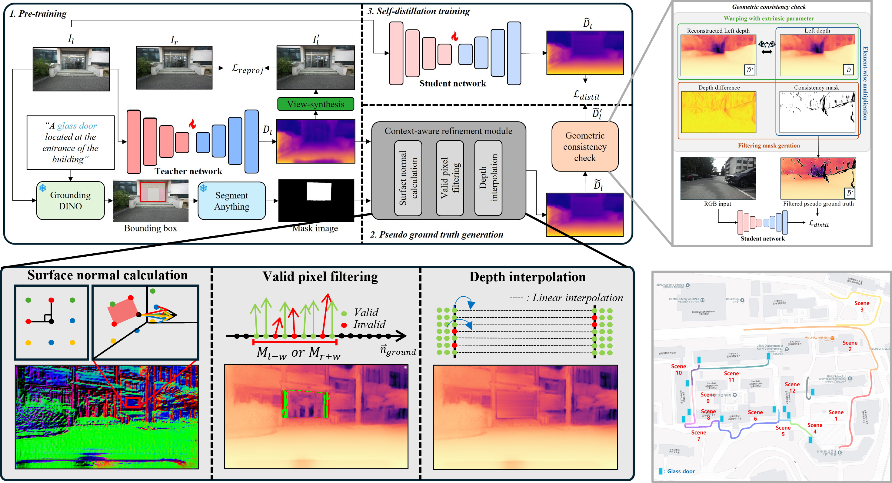

# CRM: Context-aware Refinement Module

Training code for self-supervised depth estimation in transparent environments.
This repository accompanies **Knowledge Distillation with Context-aware
Refinement for Self-Supervised Depth Estimation in Transparent Environments**.
This project is built upon
[hisfog/SfMNeXt-Impl](https://github.com/hisfog/SfMNeXt-Impl), with additional
development for context-aware refinement, knowledge distillation, and training
in transparent environments.

<div align="left">
  
</div>

## JBNU stereo: environment setup on this server

The commands in this section target the current machine:

- Ubuntu/Linux, NVIDIA driver `565.57.01`
- 5 x NVIDIA RTX 6000 Ada (48 GB)
- system CUDA Toolkit `11.8`
- project path `/ssd1/jm_data/ijcas/sqldepth_crm`

The checked-in `requirements.txt` is an archive of the original environment.
Do **not** install it directly on this server: its PyTorch entries point to
nonexistent Python 3.7 wheel files on another machine, and some of its package
pins are mutually incompatible with Python 3.10. Use the clean environment
below instead.

### 1. Create a Conda environment

```bash
source /home/milab/miniconda3/etc/profile.d/conda.sh
conda create -n crm python=3.10 pip -y
conda activate crm
python -m pip install --upgrade pip setuptools wheel
```

Install a CUDA 11.8 PyTorch build. The PyTorch wheel contains the CUDA runtime;
it does not require changing the server's system CUDA installation.

```bash
python -m pip install \
  torch==2.7.1 torchvision==0.22.1 \
  --index-url https://download.pytorch.org/whl/cu118
```

Install the packages needed by the teacher and student training code:

```bash
python -m pip install \
  numpy==2.2.6 \
  pillow==11.3.0 \
  opencv-python-headless==4.12.0.88 \
  scipy==1.15.3 \
  scikit-image==0.25.2 \
  matplotlib==3.10.5 \
  tqdm==4.67.1 \
  tensorboard==2.20.0 \
  timm==1.0.19 \
  kornia==0.8.1
```

Only `opencv-python-headless` is needed for training. Do not install
`opencv-python` alongside it unless GUI functions such as `cv2.imshow` are
required.

### 2. Verify the installation

Run all project commands from the repository root because the argument files
contain relative paths. The student trainer also imports the sibling module
`/ssd1/jm_data/ijcas/crm`.

```bash
cd /ssd1/jm_data/ijcas/sqldepth_crm

test -d /ssd1/jm_data/ijcas/data/jbnu_stereo
test -f pretrained/resnet_320x1024/models/weights_24/encoder.pth
test -f ../crm/module.py

PYTHONPATH=/ssd1/jm_data/ijcas python -c '
import torch, torchvision, cv2, kornia, skimage, timm
from trainer import Trainer
from trainer_teacehr import TeacherTrainer
print("torch:", torch.__version__)
print("torchvision:", torchvision.__version__)
print("CUDA runtime:", torch.version.cuda)
print("CUDA available:", torch.cuda.is_available())
print("GPU count:", torch.cuda.device_count())
'
```

`CUDA available` must be `True`. If it is `False`, first check that the job or
shell has access to a GPU with `nvidia-smi`.

## JBNU stereo training

The intended order is teacher first, then CRM student. Start with one GPU; the
configured batch size of 8 fits an RTX 6000 Ada. Select another GPU by changing
`CUDA_VISIBLE_DEVICES`.

### 1. Train the teacher

```bash
cd /ssd1/jm_data/ijcas/sqldepth_crm
conda activate crm

CUDA_VISIBLE_DEVICES=4 PYTHONPATH=/ssd1/jm_data/ijcas \
python train.py \
  args_files/jm/jbnu_stereo/jbnu_stereo_352x640_train_teacher.txt
```

The teacher argument file currently writes checkpoints below:

```text
logs/revision/jbnu_stereo_resnet_352x640_teacher_resnet_320x1024_weights_24/models/weights_<epoch>
```

Training uses zero-based epoch numbers, so a completed 25-epoch run normally
has `weights_24`. Confirm that it contains at least `encoder.pth` and
`depth.pth`.

### 2. Point the student at the trained teacher

Before starting the student, set `--teacher_path` in
`args_files/jm/jbnu_stereo/jbnu_stereo_352x640_train.txt` to the teacher
checkpoint to use. For a freshly completed run, that is normally:

```text
--teacher_path /ssd1/jm_data/ijcas/sqldepth_crm/logs/revision/jbnu_stereo_resnet_352x640_teacher_resnet_320x1024_weights_24/models/weights_24
```

The file currently points to
`logs/revision/teacher/models/weights_19`, which already exists but is not the
output directory of the teacher command above. Leave it unchanged only when
that existing checkpoint is intentionally being used.

### 3. Train the student

```bash
CUDA_VISIBLE_DEVICES=0 PYTHONPATH=/ssd1/jm_data/ijcas \
python train.py \
  args_files/jm/jbnu_stereo/jbnu_stereo_352x640_train.txt
```

Logs and student checkpoints are written below
`logs/revision/ablation/consistency_mask_001/jbnu_stereo_consistency`.

To keep a long run alive after disconnecting from SSH, execute the same command
inside `tmux` or `screen`. TensorBoard can be started with:

```bash
tensorboard --logdir /ssd1/jm_data/ijcas/sqldepth_crm/logs --port 6006
```

## Using your own stereo dataset

The current JBNU loader can be reused for another rectified stereo dataset if
it is converted to the layout below. `<data_root>` is the value passed through
`--data_path`; its final directory name is shown as `<dataset_name>`.

```text
<data_root>/
└── <sequence>/
    ├── image_02/data/
    │   ├── 0000000000.png
    │   └── 0000000001.png
    ├── image_03/data/
    │   ├── 0000000000.png
    │   └── 0000000001.png
    └── proj_depth/
        ├── groundtruth/
        │   ├── image_02/0000000000.npy
        │   └── image_03/0000000000.npy
        ├── groundtruth_transp/
        │   ├── image_02/0000000000.npy
        │   └── image_03/0000000000.npy
        └── groundtruth_sparse_refined/
            ├── image_02/0000000000.npy
            └── image_03/0000000000.npy
```

The naming conventions are:

- `image_02`: left image, represented by `l` in a split file
- `image_03`: right image, represented by `r` in a split file
- RGB images: zero-padded 10-digit PNG files
- depth maps: NumPy arrays with the same 10-digit stem, shape `(H, W)`,
  `float32`, and depth in metres; invalid pixels should be `0`
- `groundtruth`: regular depth used by the dataset loader
- `groundtruth_transp`: transparent-surface depth used by student validation
  and `evaluate.py`
- `groundtruth_sparse_refined`: depth collected into an evaluation archive by
  `export_gt_depth.py`

The loader accesses both left and right images for every stereo training item,
so both images with the same frame number must exist even when a split line
contains only one side.

### 1. Prepare the split files

Each line has the following format:

```text
<sequence relative to data_root> <integer frame index> <l|r>
```

For example:

```text
my_capture/drive_0001_sync 0 l
my_capture/drive_0001_sync 1 r
```

Create `train_files.txt`, `val_files.txt`, and `test_files.txt` under
`splits/jbnu_stereo`. The repository's current examples can be used as a
template. Keeping `--split jbnu_stereo` is the simplest option because
`export_gt_depth.py` currently restricts its `--split` argument to predefined
names.

Do not put a frame in a split unless its selected RGB image, opposite stereo
image, `groundtruth`, and `groundtruth_transp` files all exist. Sequence-level
train/validation/test separation is recommended to prevent frames from the
same drive leaking between sets.

### 2. Prepare transparent-object masks

Masks are not read from `<data_root>`. `datasets/mono_dataset.py` expects them
at the following sibling preprocessing path:

```text
/ssd1/jm_data/ijcas/preprocessing/post_outputs/
└── <dataset_name>/
    └── <sequence>/
        ├── image_02/data/0000000000.png
        └── image_03/data/0000000000.png
```

For example, if `--data_path /data/my_stereo`, `<dataset_name>` is
`my_stereo`. Masks are single-channel PNG images. Missing masks are silently
replaced by all-zero masks, so training can run while CRM receives no
transparent region. Verify the mask path before a full run.

The original project used
[Grounded-SAM](https://github.com/IDEA-Research/Grounded-Segment-Anything) to
prepare masks. Grounded-SAM is a separate preprocessing environment and is not
needed after masks have been generated. `generate_transparent_gt.py` currently
only lists `.npy` files; it does not generate transparent depth maps.

### 3. Set the camera parameters

The existing code contains JBNU-specific calibration values and cannot be used
unchanged for a camera with different intrinsics or baseline. Update all of the
following:

- normalized `K` and `full_res_shape` in `datasets/kitti_dataset.py`
- stereo baseline (`0.12` metres) in `datasets/mono_dataset.py`
- pixel-space `K` and the CRM baseline (`0.12`) in `trainer.py`
- `STEREO_SCALE_FACTOR` in the evaluation script when metric stereo depth is
  required

Use intrinsics corresponding to the image resolution loaded by the dataset.
The current JBNU values assume 640 x 360 source images. Also check the
hard-coded mask resize in `datasets/mono_dataset.py` when using a different
resolution.

### 4. Update the argument files

Copy the JBNU teacher, student, and evaluation argument files, then change at
least:

```text
--data_path /absolute/path/to/your/data_root
--model_name <new experiment name>
--log_dir <new log directory>
```

Keep these values when reusing `JBNUDepthDataset` and the existing split
directory:

```text
--dataset jbnu_stereo
--split jbnu_stereo
--eval_split jbnu_stereo
--use_stereo
--frame_ids 0
```

Train the teacher first, update the student's `--teacher_path` to the selected
teacher checkpoint, and then train the student as described above.

### 5. Export evaluation ground truth

`export_gt_depth.py` does not create depth from LiDAR, disparity, or RGB. For
the `jbnu_stereo` split it reads the already-created `.npy` files listed by
`splits/jbnu_stereo/test_files.txt` and packages them into one NPZ archive.

```bash
cd /ssd1/jm_data/ijcas/sqldepth_crm
conda activate crm

python export_gt_depth.py \
  --data_path /absolute/path/to/your/data_root \
  --split jbnu_stereo
```

The current script writes:

```text
splits/jbnu_stereo/gt_depths_sz.npz
```

`evaluate_depth_config.py`, however, reads
`splits/jbnu_stereo/gt_depths.npz`. Copy or rename the generated archive before
using that evaluator:

```bash
cp splits/jbnu_stereo/gt_depths_sz.npz \
   splits/jbnu_stereo/gt_depths.npz
```

After setting `--data_path` and `--load_weights_folder` in the copied
evaluation argument file, run the NPZ-based evaluator with:

```bash
python evaluate_depth_config.py \
  args_files/jm/jbnu_stereo/jbnu_stereo_352x640_eval.txt
```

Important: the JBNU branch in `export_gt_depth.py` currently always reads
`groundtruth_sparse_refined/image_02`, regardless of the `l` or `r` value in
the split. Therefore, either use only left-camera ground truth in
`test_files.txt`, or change the exporter to map `l` to `image_02` and `r` to
`image_03` before exporting a mixed-side test set. The order of arrays in the
NPZ must remain identical to the order of `test_files.txt`.

The existing JBNU dataset used by the supplied argument files is located at:

```text
/ssd1/jm_data/ijcas/data/jbnu_stereo
```

## Acknowledgements

This repository is based on
[SfMNeXt-Impl](https://github.com/hisfog/SfMNeXt-Impl) by
[hisfog](https://github.com/hisfog). We thank the authors for making their
implementation publicly available. Please also refer to the original project
for its documentation, citations, and license terms.

## Citation

Citation information will be added when the paper is published.
